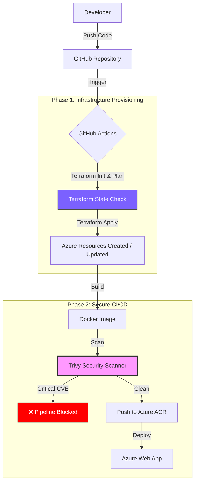
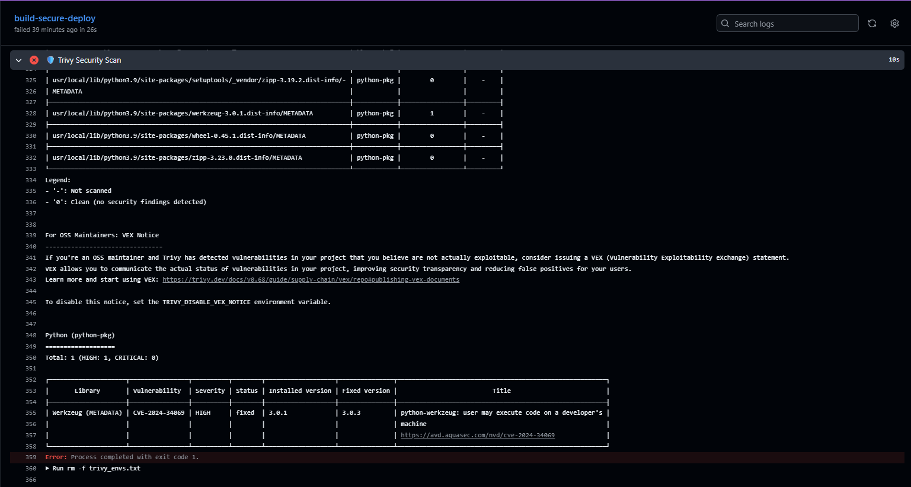
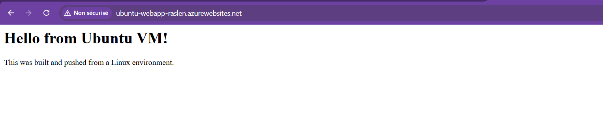

# 🛡️ Azure DevSecOps: Terraform & Secure Docker Pipeline


---

## 📖 Overview

This project demonstrates an **enterprise-grade DevSecOps pipeline** combining:

- **Infrastructure as Code (IaC)** using Terraform  
- **Secure CI/CD** using GitHub Actions  
- **Container Security** enforced by Trivy vulnerability scanning  

Every code push triggers a fully automated and secure workflow.

### 🔄 Automated Pipeline Flow

1. **Provision Infrastructure**  
   Terraform validates and applies Azure resources (Web App, ACR, Service Plan).

2. **Security Gate**  
   Trivy scans the Docker image and **blocks deployment** if HIGH or CRITICAL CVEs are found.

3. **Secure Deployment**  
   Only verified images are pushed to Azure Container Registry and deployed to Azure Web App.

---

## 🔑 Key Technologies

- **IaC:** Terraform (remote state in Azure Blob Storage)
- **Cloud:** Azure Web App for Containers, Azure Container Registry (ACR)
- **CI/CD:** GitHub Actions
- **Security:** Aqua Security Trivy
- **Containerization:** Docker (Nginx Alpine)

---

## ✅ Prerequisites

```text
OS: Ubuntu 24.04 LTS
Terraform: v1.9.0+
Docker: 28.0.0
Azure CLI: 2.61.0
```

---

## 📂 Project Structure

```text
.
├── .github/workflows
│   └── deploy.yml          # 🤖 DevSecOps CI/CD Pipeline
├── terraform
│   ├── main.tf             # 🏗️ Azure Infrastructure (IaC)
│   ├── variables.tf        # 🔧 Terraform variables
│   └── outputs.tf          # 📤 Outputs (URLs, IDs)
├── Dockerfile              # 🐳 Secure Nginx Container
├── index.html              # 🌐 Web Application
├── docs
│   └── images              # 📸 Evidence screenshots
│       ├── live-app.png
│       ├── trivy-failed.png
│       └── trivy-success.png
└── README.md
```

---

## 🏗️ Architecture Pipeline



---

## ⚙️ Configuration Snippets

### 1️⃣ Terraform Infrastructure (`main.tf`)

```hcl
resource "azurerm_linux_web_app" "webapp" {
  name                = "ubuntu-webapp-raslen"
  resource_group_name = azurerm_resource_group.rg.name
  location            = azurerm_resource_group.rg.location
  service_plan_id     = azurerm_service_plan.plan.id

  site_config {
    always_on = false
    application_stack {
      docker_image     = "${azurerm_container_registry.acr.login_server}/my-app"
      docker_image_tag = "latest"
    }
  }
}
```

---

### 2️⃣ Secure CI/CD Pipeline (`deploy.yml`)

```yaml
jobs:
  provision-infrastructure:
    runs-on: ubuntu-latest
    steps:
      - name: Terraform Apply
        run: terraform apply -auto-approve

  build-secure-deploy:
    needs: provision-infrastructure
    runs-on: ubuntu-latest
    steps:
      - name: Build Docker Image
        run: docker build -t my-app .

      - name: 🛡️ Trivy Security Scan
        uses: aquasecurity/trivy-action@master
        with:
          severity: 'CRITICAL,HIGH'
          exit-code: '1'

      - name: Push to ACR
        run: docker push my-app
```

---

## 🔐 DevSecOps in Action

### 🚨 Scenario: Vulnerability Detection

```text
Detected Package : libssl1.1
Severity         : HIGH
Action           : Pipeline failed
Result           : Deployment blocked – production remains secure
```

📸 **Blocked Build Evidence**  


📸 **Successful Deployment**  


---

<h3 align="center">
Created by <a href="https://github.com/raslen-jendoubi">Raslen Jendoubi</a> | DevSecOps Engineer
</h3>
