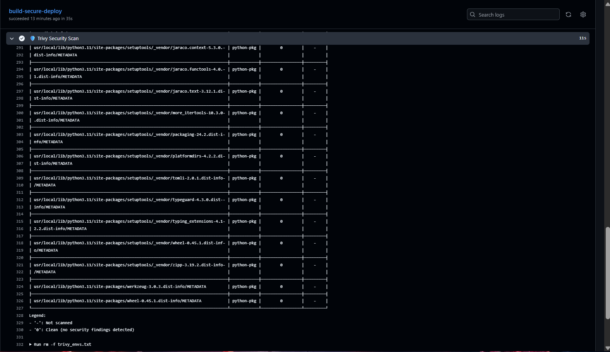

<div><br class="Apple-interchange-newline"># 🛡️ Azure DevSecOps Pipeline: Secure Flask Deployment<br><br><br><br><br><br><br>## 📖 Overview<br>This project demonstrates a complete **DevSecOps** workflow. It deploys a Python Flask application to Azure, but with a strict security gate. <br><br>Unlike traditional pipelines that deploy blindly, this workflow uses **Trivy** to scan for vulnerabilities (CVEs) before the image is ever allowed to reach the cloud registry. If a critical vulnerability is found, the pipeline blocks the deployment immediately.<br><br>**Key Technologies:**<br>* **Cloud:** Azure Web App for Containers & Azure Container Registry (ACR).<br>* **CI:** GitHub Actions (Automated Build & Scan).<br>* **CD:** Azure Continuous Deployment (Webhook-based).<br>* **Security:** Aquasecurity Trivy (Container Scanning).<br>* **Container:** Docker (Multi-stage build).<br><br>---<br>### Prerequisites<br>The project was built and tested on the following environment:<br>* **OS:** Ubuntu 24.04.3 LTS<br>* **Docker:** Version 28.0.0<br>* **Azure CLI:** Version 2.61.0<br>* **Python:** Version 3.12.3<br><br>## 📂 Project Structure<br>---text<br>.<br>├── app<br>│   ├── app.py<br>│   ├── Dockerfile<br>│   └── requirements.txt<br>└── docs<br>    └── images<br>---<br>## 🏗️ Architecture<br>The pipeline follows a "Secure Supply Chain" model:<br><br>```mermaid<br>graph TD<br>    A["Developer (Ubuntu VM)"] -->|Push Code| B("GitHub Repository")<br>    B -->|Trigger| C{"GitHub Actions"}<br>    C -->|1. Build| D[Docker Image]<br>    D -->|2. Scan| E[Trivy Security Scanner]<br>    E -- Critical CVE Found --> F[❌ BLOCK Pipeline]<br>    E -- Safe --> G["Push to Azure Registry (ACR)"]<br>    G -->|Webhook Trigger| H[Azure Web App]<br>    H -->|Pull 'latest' Image| I[Live Production Site]<br>    style E fill:#f9f,stroke:#333,stroke-width:4px<br>    style F fill:#ff0000,stroke:#333,color:white<br>```<br>## ⚙️ Configuration Snippets<br><br>### 1. The Secure Dockerfile<br>Notice how we run the application as a non-root user (`appuser`) to prevent security breaches.<br><br>```dockerfile<br>FROM python:3.11-slim<br>WORKDIR /app<br>COPY requirements.txt .<br>RUN pip install --no-cache-dir -r requirements.txt<br>COPY . .<br>RUN useradd -m appuser<br>USER appuser<br>EXPOSE 5000<br>CMD ["python", "app.py"]<br><br>```<br>### 2. The CI/CD Pipeline (GitHub Actions)<br>This YAML configuration defines the automation logic, including the critical **Trivy Security Scan** step.<br><br>```yaml<br>name: Ubuntu DevSecOps Pipeline<br><br>on:<br>  push:<br>    branches: [ "main" ]<br><br>env:<br>  IMAGE_NAME: flask-app<br>  ACR_NAME: ubuntuacrraslen <br><br>jobs:<br>  build-secure-deploy:<br>    runs-on: ubuntu-latest<br>    steps:<br>      - name: Checkout<br>        uses: actions/checkout@v3<br><br>      - name: Login to Azure ACR<br>        uses: docker/login-action@v2<br>        with:<br>          registry: ${{ secrets.ACR_LOGIN_SERVER }}<br>          username: ${{ secrets.ACR_USERNAME }}<br>          password: ${{ secrets.ACR_PASSWORD }}<br><br>      - name: Build Docker Image<br>        run: docker build -t ${{ secrets.ACR_LOGIN_SERVER }}/${{ env.IMAGE_NAME }}:${{ github.sha }} -t ${{ secrets.ACR_LOGIN_SERVER }}/${{ env.IMAGE_NAME }}:latest ./app<br><br>      - name: 🛡️ Trivy Security Scan<br>        uses: aquasecurity/trivy-action@master<br>        with:<br>          image-ref: '${{ secrets.ACR_LOGIN_SERVER }}/${{ env.IMAGE_NAME }}:${{ github.sha }}'<br>          format: 'table'<br>          exit-code: '1' # Fails if critical bugs found<br>          ignore-unfixed: true<br>          severity: 'CRITICAL,HIGH'<br><br>      - name: Push to ACR<br>        run: docker push --all-tags ${{ secrets.ACR_LOGIN_SERVER }}/${{ env.IMAGE_NAME }}<br>```<br>## 🔐 DevSecOps in Action (Vulnerability Management)<br>This project is not just theoretical. During development, I successfully identified and patched a real-world vulnerability to prove the pipeline's security gate works.<br><br>### 1. The Incident (Blocking the Build)<br>* **Detection:** The automated Trivy scan flagged `Werkzeug 3.0.1` as having a **HIGH** severity vulnerability (`CVE-2024-34069`).<br>* **Action:** The pipeline correctly **failed** the build, preventing the insecure code from reaching production.<br><br>**Evidence of blocked build:**<br><br><br>### 2. The Remediation (Patching the Code)<br>* 
    **Fix:** I analysed the report, upgraded the dependency to `Werkzeug 3.0.3` in `requirements.txt`, and re-pushed.<br>* **Result:** The scan passed, and the pipeline automatically resumed deployment.<br><br>**Evidence of Clean Scan:**<br><br><br>### 
    3. The Result (Live Deployment)<br>With the security gate passed, the application was deployed to Azure Web App for Containers.<br><br>**Live Site:**<br><br>
