# 🛡️ Azure DevSecOps Pipeline: Secure Flask Deployment


---

## 📖 Overview

This project demonstrates a complete **DevSecOps** workflow for deploying a **Python Flask** application to **Microsoft Azure**, with **security enforced as a mandatory gate**.

Unlike traditional CI/CD pipelines that deploy blindly, this pipeline integrates **Trivy vulnerability scanning**.  
If **HIGH** or **CRITICAL** CVEs are detected, deployment is **immediately blocked**, preventing insecure images from reaching production.

### 🔑 Key Technologies

- **Cloud:** Azure Web App for Containers, Azure Container Registry (ACR)
- **CI:** GitHub Actions
- **CD:** Azure Continuous Deployment (Webhook-based)
- **Security:** Aqua Security Trivy
- **Containerization:** Docker (secure, non-root execution)

---

## ✅ Prerequisites

```text
OS: Ubuntu 24.04.3 LTS
Docker: 28.0.0
Azure CLI: 2.61.0
Python: 3.12.3
```

---

## 📂 Project Structure

```text
.
├── app
│   ├── app.py
│   ├── Dockerfile
│   └── requirements.txt
└── docs
    └── images
```

---

## 🏗️ Architecture

```mermaid
graph TD
    A["Developer (Ubuntu VM)"] -->|Push Code| B["GitHub Repository"]
    B -->|Trigger| C{"GitHub Actions"}
    C -->|1. Build| D[Docker Image]
    D -->|2. Scan| E[Trivy Security Scanner]
    E -- Critical CVE Found --> F[❌ Pipeline Blocked]
    E -- Safe --> G["Push to Azure Container Registry"]
    G -->|Webhook Trigger| H[Azure Web App]
    H -->|Pull Latest Image| I[Live Production Site]

    style E fill:#f9f,stroke:#333,stroke-width:3px
    style F fill:#ff0000,stroke:#333,color:#fff
```



---

## ⚙️ Configuration Snippets

### 1️⃣ Secure Dockerfile

```dockerfile
FROM python:3.11-slim

WORKDIR /app

COPY requirements.txt .
RUN pip install --no-cache-dir -r requirements.txt

COPY . .

RUN useradd -m appuser
USER appuser

EXPOSE 5000

CMD ["python", "app.py"]
```

---

### 2️⃣ CI/CD Pipeline (GitHub Actions)

```yaml
name: Ubuntu DevSecOps Pipeline

on:
  push:
    branches: ["main"]

env:
  IMAGE_NAME: flask-app
  ACR_NAME: ubuntuacrraslen

jobs:
  build-secure-deploy:
    runs-on: ubuntu-latest

    steps:
      - name: Checkout Repository
        uses: actions/checkout@v3

      - name: Login to Azure Container Registry
        uses: docker/login-action@v2
        with:
          registry: ${{ secrets.ACR_LOGIN_SERVER }}
          username: ${{ secrets.ACR_USERNAME }}
          password: ${{ secrets.ACR_PASSWORD }}

      - name: Build Docker Image
        run: |
          docker build \
            -t ${{ secrets.ACR_LOGIN_SERVER }}/${{ env.IMAGE_NAME }}:${{ github.sha }} \
            -t ${{ secrets.ACR_LOGIN_SERVER }}/${{ env.IMAGE_NAME }}:latest \
            ./app

      - name: 🛡️ Trivy Security Scan
        uses: aquasecurity/trivy-action@master
        with:
          image-ref: '${{ secrets.ACR_LOGIN_SERVER }}/${{ env.IMAGE_NAME }}:${{ github.sha }}'
          format: 'table'
          exit-code: '1'
          ignore-unfixed: true
          severity: 'CRITICAL,HIGH'

      - name: Push Image to ACR
        run: docker push --all-tags ${{ secrets.ACR_LOGIN_SERVER }}/${{ env.IMAGE_NAME }}
```

---

## 🔐 DevSecOps in Action – Vulnerability Management

### 🚨 Incident: Build Blocked

```text
Detected Package : Werkzeug 3.0.1
CVE             : CVE-2024-34069
Severity        : HIGH
Action          : Pipeline failed (deployment blocked)
```


---

### 🛠️ Remediation

```text
Fix Applied     : Upgraded Werkzeug to 3.0.3
File Modified  : requirements.txt
Result         : Security scan passed
```


---

### 🚀 Final Result


---

<h3 align="center">
Created by <a href="https://www.linkedin.com/in/raslenjendoubi/">Raslen Jendoubi</a>
</h3>
