# 🛡️ Azure DevSecOps Pipeline: Secure Flask Deployment


## 📖 Overview
This project demonstrates a complete **DevSecOps** workflow. It deploys a Python Flask application to Azure, but with a strict security gate. 

Unlike traditional pipelines that deploy blindly, this workflow uses **Trivy** to scan for vulnerabilities (CVEs) before the image is ever allowed to reach the cloud registry. If a critical vulnerability is found, the pipeline blocks the deployment immediately.

**Key Technologies:**
* **Cloud:** Azure Web App for Containers & Azure Container Registry (ACR).
* **CI:** GitHub Actions (Automated Build & Scan).
* **CD:** Azure Continuous Deployment (Webhook-based).
* **Security:** Aquasecurity Trivy (Container Scanning).
* **Container:** Docker (Multi-stage build).

---
### Prerequisites
The project was built and tested on the following environment:
* **OS:** Ubuntu 24.04.3 LTS
* **Docker:** Version 28.0.0
* **Azure CLI:** Version 2.61.0
* **Python:** Version 3.12.3
## 📂 Project Structure
text
.
├── app
│   ├── app.py
│   ├── Dockerfile
│   └── requirements.txt
└── docs
    └── images
---
## 🏗️ Architecture
The pipeline follows a "Secure Supply Chain" model:

```mermaid
graph TD
    A["Developer (Ubuntu VM)"] -->|Push Code| B("GitHub Repository")
    B -->|Trigger| C{"GitHub Actions"}
    C -->|1. Build| D[Docker Image]
    D -->|2. Scan| E[Trivy Security Scanner]
    E -- Critical CVE Found --> F[❌ BLOCK Pipeline]
    E -- Safe --> G["Push to Azure Registry (ACR)"]
    G -->|Webhook Trigger| H[Azure Web App]
    H -->|Pull 'latest' Image| I[Live Production Site]
    style E fill:#f9f,stroke:#333,stroke-width:4px
    style F fill:#ff0000,stroke:#333,color:white
```


## ⚙️ Configuration Snippets

### 1. The Secure Dockerfile
Notice how we run the application as a non-root user (`appuser`) to prevent security breaches.

```dockerfile
FROM python:3.11-slim
WORKDIR /app
COPY requirements.txt .
RUN pip install --no-cache-dir -r requirements.txt
COPY . .
RUN useradd -m appuser
USER appuser
EXPOSE 5000
CMD ["python", "app.py"]

```
## 🔐 DevSecOps in Action (Vulnerability Management)
This project is not just theoretical. During development, I successfully identified and patched a real-world vulnerability to prove the pipeline's security gate works.

### 1. The Incident (Blocking the Build)
* **Detection:** The automated Trivy scan flagged `Werkzeug 3.0.1` as having a **HIGH** severity vulnerability (`CVE-2024-34069`).
* **Action:** The pipeline correctly **failed** the build, preventing the insecure code from reaching production.

**Evidence of blocked build:**


### 2. The Remediation (Patching the Code)
* **Fix:** I analysed the report, upgraded the dependency to `Werkzeug 3.0.3` in `requirements.txt`, and re-pushed.
* **Result:** The scan passed, and the pipeline automatically resumed deployment.

**Evidence of Clean Scan:**


### 3. The Result (Live Deployment)
With the security gate passed, the application was deployed to Azure Web App for Containers.

**Live Site:**

